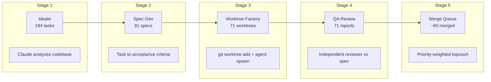
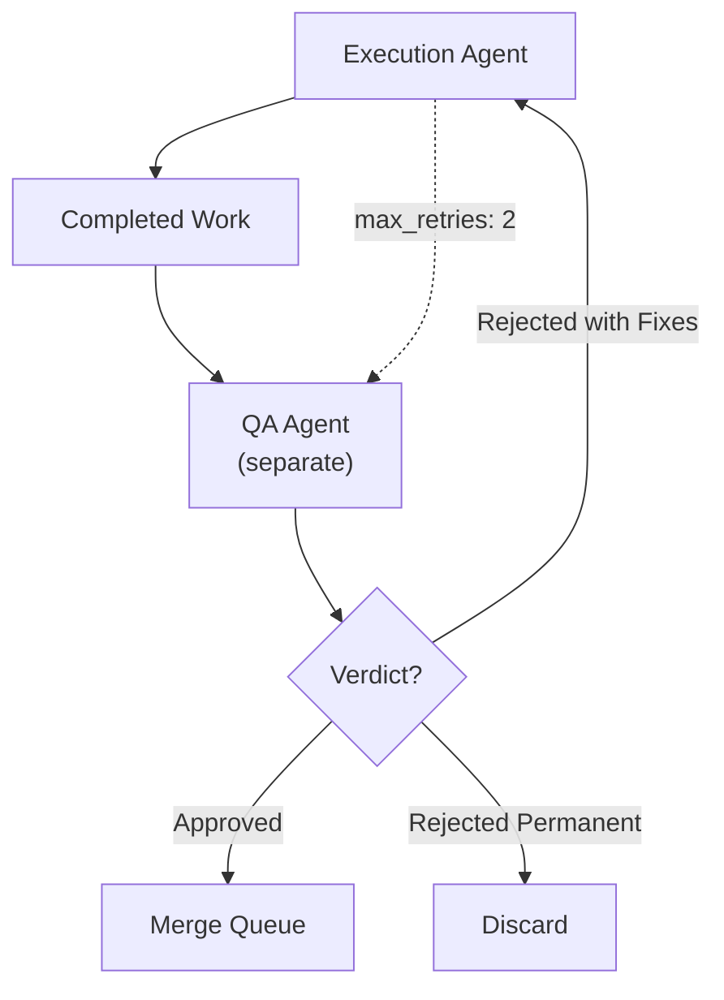

## 194 Parallel AI Worktrees

I gave an AI 194 tasks, 194 isolated copies of a codebase, and told it to build. The execution agents were not the hard part. The QA pipeline was.

This is the story of auto-claude-worktrees — a system that uses git worktrees to spin up dozens of parallel AI agents, each working in complete filesystem isolation, then runs independent QA agents to decide what ships and what gets sent back for fixes. The numbers from one real project: 194 tasks ideated, 91 specs generated, 71 QA reports produced, 3,066 sessions consumed, 470 MB of conversation data.

The companion repo has the full pipeline: [github.com/krzemienski/auto-claude-worktrees](https://github.com/krzemienski/auto-claude-worktrees)

---

### The Problem with Parallel AI Development

When you ask one AI agent to build a large feature, it works sequentially through a long chain of changes. If it makes a mistake in step 3, steps 4 through 20 compound the error. If you ask it to fix step 3, it often breaks step 7 in the process.

The obvious answer is parallelism. Break the work into independent tasks, run them simultaneously. But naive parallelism hits an immediate wall: merge conflicts. If agent A modifies `utils.py` at line 40 and agent B modifies `utils.py` at line 50, you have a conflict that neither agent anticipated.

Git worktrees solve this cleanly. Each worktree is a full copy of the repository on a separate branch. No shared filesystem state. No cross-contamination. The conflicts only surface at merge time, when you can handle them systematically instead of reactively.

```
auto-claude full --repo ./my-project --workers 8
```

That single command runs five pipeline stages that took me months to get right.



---

### Stage 1: Ideation — Over-Generate Deliberately

The ideation phase uses Claude to analyze the entire codebase and generate a task manifest. The data model for each task:

```python
# From: src/auto_claude/models.py

class Task(BaseModel):
    id: str = Field(description="Unique task identifier, e.g. 'modularization', 'reduce-any-types'")
    title: str = Field(description="Human-readable task title")
    description: str = Field(description="Detailed description of what needs to be done")
    scope: list[str] = Field(
        default_factory=list,
        description="Files and modules affected by this task",
    )
    dependencies: list[str] = Field(
        default_factory=list,
        description="Task IDs that must complete before this task",
    )
    priority: TaskPriority = Field(default=TaskPriority.MEDIUM)
    status: TaskStatus = Field(default=TaskStatus.IDEATED)
    tags: list[str] = Field(default_factory=list, description="Categorization tags")
```

Two methods on the `Task` model enable the pipeline's dependency and conflict logic:

```python
# From: src/auto_claude/models.py

def is_blocked(self, completed_task_ids: set[str]) -> bool:
    """Check if this task is blocked by incomplete dependencies."""
    return bool(set(self.dependencies) - completed_task_ids)

def has_scope_overlap(self, other: Task) -> bool:
    """Check if two tasks modify overlapping files."""
    return bool(set(self.scope) & set(other.scope))
```

The priority enum determines merge order later:

```python
# From: src/auto_claude/models.py

class TaskPriority(str, enum.Enum):
    CRITICAL = "critical"
    HIGH = "high"
    MEDIUM = "medium"
    LOW = "low"
```

A critical design decision: the ideation phase over-generates deliberately. Generating 194 task descriptions costs a fraction of executing one. The QA pipeline downstream filters what should not ship. This is the opposite of how most people think about AI task planning — they try to generate exactly the right set of tasks upfront. That precision is expensive and fragile. Casting a wide net and filtering is cheaper and more robust.

---

### Stage 2: Specs — The Real Bottleneck

Raw task descriptions are not enough for autonomous agents. "Improve error handling" is too vague. The spec generator produces detailed implementation blueprints:

```python
# From: src/auto_claude/models.py

class Spec(BaseModel):
    task_id: str = Field(description="ID of the source task")
    objective: str = Field(description="Single-sentence end-state description")
    files_in_scope: list[str] = Field(
        description="Explicit list of files to create, modify, or delete"
    )
    implementation_steps: list[str] = Field(
        description="Ordered sequence of changes to make"
    )
    acceptance_criteria: list[str] = Field(
        description="Concrete, verifiable conditions for completion"
    )
    risk_notes: list[str] = Field(
        default_factory=list,
        description="Known pitfalls, edge cases, or compatibility concerns",
    )
```

The `acceptance_criteria` field is the most important. It is the contract between the execution agent and the QA agent. Every criterion must be concrete and verifiable — not "code is clean" but "all public functions have docstrings" or "error paths return structured error responses."

Each spec gets formatted into a prompt context that the execution agent can reference:

```python
# From: src/auto_claude/models.py

def to_prompt_context(self) -> str:
    lines = [
        f"# Task: {self.task_id}",
        f"\n## Objective\n{self.objective}",
        "\n## Files in Scope",
    ]
    for f in self.files_in_scope:
        lines.append(f"- {f}")
    lines.append("\n## Implementation Steps")
    for i, step in enumerate(self.implementation_steps, 1):
        lines.append(f"{i}. {step}")
    lines.append("\n## Acceptance Criteria")
    for criterion in self.acceptance_criteria:
        lines.append(f"- [ ] {criterion}")
    return "\n".join(lines)
```

Specs are the bottleneck, not execution. A precise spec passes QA on the first attempt. A vague spec produces work that gets rejected, fixed, re-reviewed, and sometimes rejected again. The ~22% first-pass rejection rate in our data correlates directly with spec precision — tasks with five or more concrete acceptance criteria had a significantly lower rejection rate than tasks with two or three vague ones.

---

### Stage 3: The Worktree Factory

This is the core of the system. For each spec, the factory creates a git worktree, injects the spec, and spawns a Claude agent:

```python
# From: src/auto_claude/factory.py

def create_worktree(
    repo_path: Path,
    branch_name: str,
    base_dir: Path,
) -> Path:
    base_dir.mkdir(parents=True, exist_ok=True)
    worktree_path = base_dir / branch_name.replace("/", "-")

    # Remove existing worktree if it exists (from a previous run)
    if worktree_path.exists():
        subprocess.run(
            ["git", "worktree", "remove", "--force", str(worktree_path)],
            cwd=repo_path, capture_output=True,
        )

    # Delete branch if it exists (from a previous run)
    subprocess.run(
        ["git", "branch", "-D", branch_name],
        cwd=repo_path, capture_output=True,
    )

    # Create fresh worktree with new branch
    result = subprocess.run(
        ["git", "worktree", "add", "-b", branch_name, str(worktree_path)],
        cwd=repo_path, capture_output=True, text=True,
    )

    if result.returncode != 0:
        raise RuntimeError(
            f"Failed to create worktree '{branch_name}': {result.stderr.strip()}"
        )

    return worktree_path
```

After creating the worktree, the spec gets injected as a context file — both human-readable markdown and machine-readable JSON:

```python
# From: src/auto_claude/factory.py

def inject_spec(worktree_path: Path, spec: Spec) -> Path:
    spec_dir = worktree_path / ".auto-claude"
    spec_dir.mkdir(exist_ok=True)

    spec_md = spec_dir / "spec.md"
    spec_md.write_text(spec.to_prompt_context())

    spec_json = spec_dir / "spec.json"
    with open(spec_json, "w") as f:
        json.dump(spec.model_dump(mode="json"), f, indent=2, default=str)

    return spec_md
```

Then a Claude agent is spawned, scoped entirely to that worktree's filesystem:

```python
# From: src/auto_claude/factory.py

def spawn_agent(
    worktree_path: Path,
    spec: Spec,
    config: PipelineConfig,
) -> subprocess.Popen[str]:
    prompt = f"""\
Execute this implementation spec in your current working directory.

{spec.to_prompt_context()}

After completing all steps:
1. Verify each acceptance criterion is met
2. Commit all changes with descriptive messages
3. Create a COMPLETION.md file summarizing what was done
"""

    cmd = [
        "claude", "--print",
        "--model", config.model,
        "--system-prompt", EXECUTION_SYSTEM_PROMPT,
        prompt,
    ]

    process = subprocess.Popen(
        cmd,
        cwd=worktree_path,
        stdout=subprocess.PIPE,
        stderr=subprocess.PIPE,
        text=True,
    )

    return process
```

The parallel execution uses `ThreadPoolExecutor`. The config controls concurrency:

```python
# From: src/auto_claude/factory.py

def run_factory(specs, repo_path, config):
    # ...
    with ThreadPoolExecutor(max_workers=config.max_parallel_workers) as executor:
        future_to_spec = {
            executor.submit(
                execute_in_worktree, spec, repo_path, config, base_dir,
            ): spec
            for spec in specs
        }

        for future in as_completed(future_to_spec):
            spec = future_to_spec[future]
            try:
                state = future.result()
                states.append(state)
            except Exception as e:
                logger.error("Unexpected error executing '%s': %s", spec.task_id, e)
```

Each worktree execution is tracked through a lifecycle model:

```python
# From: src/auto_claude/models.py

class TaskStatus(str, enum.Enum):
    IDEATED = "ideated"
    SPECIFIED = "specified"
    IN_PROGRESS = "in_progress"
    COMPLETED = "completed"
    QA_PENDING = "qa_pending"
    QA_APPROVED = "qa_approved"
    QA_REJECTED = "qa_rejected"
    QA_REJECTED_PERMANENT = "qa_rejected_permanent"
    MERGE_READY = "merge_ready"
    MERGE_COMPLETE = "merge_complete"
    MERGE_CONFLICT = "merge_conflict"
    FAILED = "failed"
```

Thirteen states. That might seem excessive until you realize each state represents a decision point where the pipeline needs to know what to do next.

---

### Stage 4: QA — Where Quality Actually Comes From

This is the insight that took months to internalize: the QA pipeline matters more than the execution agents.

The QA system has three possible verdicts:

```python
# From: src/auto_claude/models.py

class QAVerdict(str, enum.Enum):
    APPROVED = "approved"
    REJECTED_WITH_FIXES = "rejected_with_fixes"
    REJECTED_PERMANENT = "rejected_permanent"
```

The first principle, stated explicitly in the QA agent's system prompt:

```python
# From: src/auto_claude/qa.py

QA_SYSTEM_PROMPT = """\
You are an independent QA reviewer for an autonomous development pipeline.

IMPORTANT: You are NOT the agent that wrote this code. You are a separate reviewer
with fresh eyes. Do not assume anything works -- verify everything against the spec.

Your job is to review the code changes in this worktree against the original
implementation specification and produce a verdict:

1. "approved" -- All acceptance criteria met, code quality acceptable, no regressions
2. "rejected_with_fixes" -- Specific issues found, but the approach is sound. Provide
   detailed remediation instructions for the execution agent.
3. "rejected_permanent" -- Fundamental approach is flawed. Task needs re-specification.
"""
```

QA agents must be separate from execution agents. Self-review does not work. The same biases that led an agent to write buggy code lead it to overlook those bugs in review. This is not a theoretical concern — it is a pattern I observed repeatedly. An execution agent that misunderstands a requirement will confidently report that requirement as met. A separate reviewer catches the gap.

The QA context is built from the original spec, the git diff, and any completion notes:

```python
# From: src/auto_claude/qa.py

def build_qa_context(state: WorktreeState) -> str:
    parts: list[str] = []

    parts.append("# Original Specification\n")
    parts.append(state.spec.to_prompt_context())

    parts.append("\n\n# Code Changes (git diff)\n")
    diff_result = subprocess.run(
        ["git", "diff", "HEAD~..HEAD", "--stat"],
        cwd=state.worktree_path, capture_output=True, text=True,
    )
    if diff_result.returncode == 0 and diff_result.stdout.strip():
        parts.append(f"```\n{diff_result.stdout.strip()}\n```\n")

    # Full diff (capped at 10000 chars to avoid token explosion)
    full_diff = subprocess.run(
        ["git", "diff", "HEAD~..HEAD"],
        cwd=state.worktree_path, capture_output=True, text=True,
    )
    if full_diff.returncode == 0 and full_diff.stdout.strip():
        diff_text = full_diff.stdout.strip()[:10000]
        parts.append(f"```diff\n{diff_text}\n```")

    return "\n".join(parts)
```



---

### The Rejection-and-Fix Cycle

When QA rejects a task, the system sends it back to the execution agent with specific remediation instructions:

```python
# From: src/auto_claude/qa.py

def send_back_for_fixes(state, qa_result, config):
    fix_prompt = f"""\
Your previous implementation was reviewed and REJECTED. Fix the following issues:

## QA Summary
{qa_result.summary}

## Failed Criteria
{chr(10).join(f'- {c}' for c in qa_result.failed_criteria)}

## Specific Issues
{chr(10).join(f'- {i}' for i in qa_result.issues)}

## Remediation Instructions
{chr(10).join(f'{n+1}. {inst}' for n, inst in enumerate(qa_result.remediation_instructions))}

Fix ALL issues listed above. Then commit your changes and update COMPLETION.md.
"""

    cmd = [
        "claude", "--print",
        "--model", config.model,
        "--system-prompt", factory.EXECUTION_SYSTEM_PROMPT,
        fix_prompt,
    ]

    result = subprocess.run(
        cmd, capture_output=True, text=True,
        cwd=state.worktree_path, timeout=config.timeout_seconds,
    )
    state.retry_count += 1
    state.session_count += 1
```

The full QA pipeline runs review, rejection, fix, and re-review cycles:

```python
# From: src/auto_claude/qa.py

def run_qa_pipeline(states, config):
    completed = [s for s in states if s.status == TaskStatus.COMPLETED]
    all_results: list[QAResult] = []

    with ThreadPoolExecutor(max_workers=config.max_parallel_workers) as executor:
        # First pass review
        future_to_state = {
            executor.submit(review_single_task, state, config, 1): state
            for state in completed
        }

        for future in as_completed(future_to_state):
            state = future_to_state[future]
            qa_result = future.result()
            all_results.append(qa_result)

            if qa_result.is_approved():
                state.status = TaskStatus.QA_APPROVED
            elif qa_result.is_permanently_rejected():
                state.status = TaskStatus.QA_REJECTED_PERMANENT
            else:
                state.status = TaskStatus.QA_REJECTED

    # Fix-and-retry cycles for rejected tasks
    for retry in range(config.max_retries):
        rejected = [s for s in completed if s.status == TaskStatus.QA_REJECTED]
        if not rejected:
            break

        for state in rejected:
            task_results = [r for r in all_results if r.task_id == state.task_id]
            last_rejection = task_results[-1]

            state = send_back_for_fixes(state, last_rejection, config)

            if state.status == TaskStatus.QA_PENDING:
                qa_result = review_single_task(state, config, retry + 2)
                all_results.append(qa_result)
```

The numbers tell the story. First-pass rejection rate: ~22%. Second-pass approval rate: ~95%. The rejection-and-fix cycle is where quality comes from. Without QA, the execution agents produce code that looks correct but has subtle gaps — missed edge cases, incomplete error handling, hardcoded values that should be configurable. The QA agent catches these because it reviews against the spec's acceptance criteria with fresh eyes.

---

### Stage 5: Merge Queue — Priority-Weighted Topological Sort

The merge queue is the final piece. Not all approved branches can merge cleanly — parallel development means potential conflicts. The merge order matters:

```python
# From: src/auto_claude/merge.py

def compute_merge_order(tasks, approved_ids):
    approved_tasks = [t for t in tasks if t.id in approved_ids]

    sorted_ids: list[str] = []
    visited: set[str] = set()
    in_progress: set[str] = set()

    task_map = {t.id: t for t in approved_tasks}

    def visit(task_id: str) -> None:
        if task_id in visited:
            return
        if task_id in in_progress:
            logger.warning("Circular dependency detected involving '%s'", task_id)
            return

        in_progress.add(task_id)
        task = task_map[task_id]

        for dep in task.dependencies:
            if dep in approved_ids:
                visit(dep)

        in_progress.discard(task_id)
        visited.add(task_id)
        sorted_ids.append(task_id)

    for task in sorted(
        approved_tasks,
        key=lambda t: (priority_order[t.priority], len(t.scope), t.id),
    ):
        visit(task.id)

    return sorted_ids
```

Foundation tasks merge first. Small, focused tasks before broad refactors. Dependencies respected. Within the same priority level, tasks with narrower scope merge before wider ones — the intuition being that narrow changes are less likely to conflict with later merges.

Before each merge, a dry-run conflict check prevents partial merges:

```python
# From: src/auto_claude/merge.py

def check_conflicts(repo_path, branch_name):
    result = subprocess.run(
        ["git", "merge", "--no-commit", "--no-ff", branch_name],
        cwd=repo_path, capture_output=True, text=True,
    )

    conflicts: list[str] = []

    if result.returncode != 0:
        status = subprocess.run(
            ["git", "diff", "--name-only", "--diff-filter=U"],
            cwd=repo_path, capture_output=True, text=True,
        )
        if status.stdout.strip():
            conflicts = status.stdout.strip().split("\n")

    subprocess.run(
        ["git", "merge", "--abort"],
        cwd=repo_path, capture_output=True,
    )

    return conflicts
```

Tasks with conflicts get flagged for re-execution against the updated main. They do not just fail — they re-enter the pipeline with fresh context.

---

### The Configuration

The whole pipeline is configurable through a TOML file:

```toml
# From: config/default.toml

[pipeline]
max_parallel_workers = 4
model = "sonnet"
qa_model = "opus"
timeout_seconds = 600
max_retries = 2

[qa]
criteria = [
    "All acceptance criteria from the spec are met",
    "No regressions introduced in existing functionality",
    "Code quality meets project standards (formatting, naming, structure)",
    "No hardcoded values that should be configurable",
    "Error handling is present for failure paths",
]

[ideation]
model = "opus"
max_tasks = 200

[merge]
strategy = "priority-weighted"
auto_resolve_conflicts = false
```

Notice the model split: opus for ideation and QA (where reasoning quality matters most), sonnet for execution (where speed and volume matter more). This is not arbitrary — ideation and QA are judgment tasks. Execution is mostly mechanical once the spec is precise.

---

### The Numbers and What They Mean

From the Awesome List project:

```
Tasks ideated:                 194
Specs generated:                91
QA reports produced:            71
Git branches created:           90
Total sessions:              3,066
Conversation data:           470 MB
QA first-pass rejection rate:  ~22%
QA second-pass approval rate:  ~95%
```

194 tasks ideated, 91 specs generated. The gap is intentional — some tasks are blocked by dependencies, some are deferred because spec generation fails, some overlap and get merged. Over-generation at the ideation phase feeds the funnel without waste because ideation is cheap.

The 22% first-pass rejection rate is the most important number. It means more than one in five execution attempts produce work that a separate reviewer deems insufficient. Without the QA pipeline, that 22% would have shipped as-is. Some of those rejections were missing edge cases. Some were incomplete implementations. Some were hardcoded values. All of them were things the execution agent thought were correct.

The 95% second-pass approval rate validates the fix cycle. When an agent gets specific, actionable feedback about what failed and why, it almost always fixes the issues. The rejection is not "try again" — it is structured remediation with failed criteria, specific issues, and step-by-step fix instructions.

3,066 sessions across 71 tasks means an average of ~43 sessions per task. Session count correlates with task breadth, not difficulty. Wide tasks that touch many files consume more sessions than complex but narrow ones. This is useful for capacity planning — if you know a task touches 15 files, budget more sessions than a task that deeply refactors 3 files.

---

### Four Lessons from the Factory Floor

**First: isolation is non-negotiable.** Git worktrees provide free, total filesystem separation. No shared state. No "oops, agent A overwrote agent B's changes." The isolation is not a nice-to-have — it is the foundation that makes everything else possible. Without it, parallel AI development devolves into merge conflict whack-a-mole.

**Second: specs are the bottleneck, not execution.** A precise spec with five concrete acceptance criteria passes QA on the first attempt. A vague spec with two criteria gets rejected, fixed, re-reviewed, and sometimes re-rejected. The spec generation phase determines the quality of everything downstream. Investing in better specs has a higher return than investing in smarter execution agents.

**Third: QA agents must be separate from execution agents.** Self-review does not work at scale. The same reasoning patterns that produce buggy code produce confident-but-incorrect self-assessments. The independent reviewer catches what the author cannot see.

**Fourth: the rejection-and-fix cycle is where quality comes from.** The goal is not first-pass perfection. The goal is a tight feedback loop: execute, review, reject with specifics, fix, re-review. The 22% first-pass rejection rate is not a failure — it is the system working as designed. The 95% second-pass approval rate proves the cycle works.

Companion repo: [github.com/krzemienski/auto-claude-worktrees](https://github.com/krzemienski/auto-claude-worktrees)

---

*Part 6 of 11 in the [Agentic Development](https://github.com/krzemienski/agentic-development-guide) series.*

`#AgenticDevelopment` `#GitWorktrees` `#AIEngineering` `#ParallelDevelopment` `#QualityAssurance`
